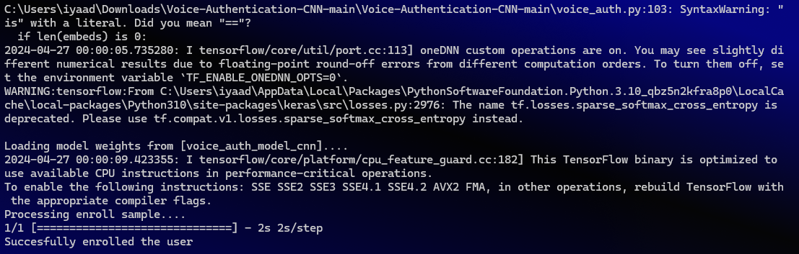
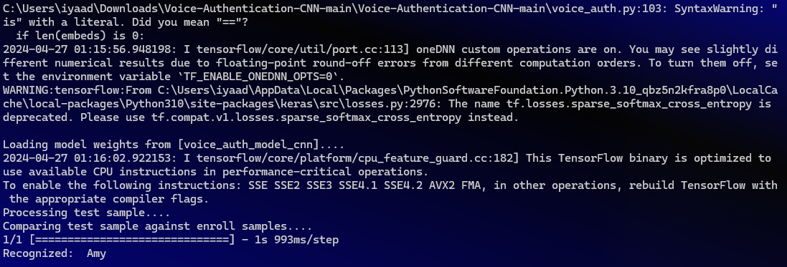

# Viz-Pay

## Banking on Your Voice: A Secure and Inclusive Financial Future for All

Cash is king, but what about voice? Design a revolutionary voice-based financial platform for India.  Remember, security and regional language accessibility are key! How can NLP make financial transactions faster, safer, and inclusive for everyone, regardless of location or dialect? 

PROBLEM STATEMENT OPTED FOR : 
To design a revolutionary voice based financial platform by leveraging NLP(Natural Language Processing)making financial transactions faster, safer and inclusive.

## APPPROACH:

 So we have designed an app called Vizpay, similar to what has been explained above by including voice assisted transactions as our core feature. The NLP module was built with the help of Gemini API, which addressed to various scenarios of making payments by the user. 
 
 For example if the user mentions both the recievers name and the amount to paid then transaction is made directly following the confirmation prompt page which confirms with the user on whether they are sure about that particular transaction . 
 
  After we completed the thorough brainstorming of a solution we split our ideas in to Primary and Stretching goals. 
  Primary Goals: 
  >>Integrating NLP guided Voice to Speech conversion module to tranfer funds via voice commands >>Voice authentication of the user backed up by fingerprint biometrics Stretching goals: >>Multilanguage Functionality using Hugging face
 >>Voice assisted Splitwise inspired feature.Splitwise is an app where the financial expenditure of a group of people can effectively be split by inputting who paid for what and when. And we were ignited by an idea to bring in voice assitance in play to make the whole process more eficient.

# Our Progress in Voice Biometric Authentication 

##  OUR PROGRESS:

Although we could not achieve all our primary goals due to the complexity associated with them, we successfully completed the main goal which was voice assisted fund transactions. 

We have put our constant efforts in perfecrting the voice authentication but the refining needs lot of training for which were short on time. But our intense research on that domain will be helpful four the future scope 

Similarly, the Hugging face MMS1Bfl102 module which we leveraged for the multilingual functionality involved numerous complications due to the unavailability of access to different  language packages.

## PROGRESS AND FUTURE SCOPE:

While the initial development phase focused on core functionalities, Vizpay is poised for future advancements:

Voice Authentication Refinement: Continued research and training will further refine voice authentication for enhanced security.

Multilingual Functionality: Exploring alternative solutions to access language packages will unlock the potential for a truly global financial platform.

Expanding Features: Future iterations may integrate features like voice-assisted budgeting tools and Splitwise-inspired functionalities for managing group finances.

## CONCLUSION: 

Vizpay represents a significant step forward in voice-based financial technology.  Its core functionality of voice-activated transactions offers a convenient and secure way to manage your finances.  With continuous development and a focus on accessibility and security, Vizpay has the potential to become the go-to platform for a truly inclusive and user-friendly banking experience.
 
## Our Proposed Solution: Creating a voice assitant which helps the user to send money to another user using voice commands. 

